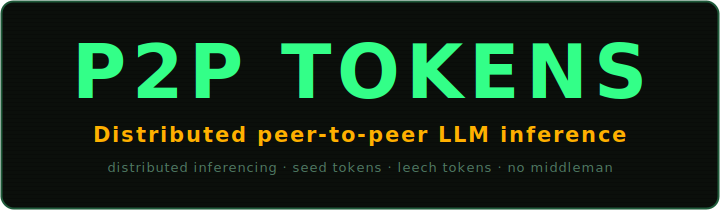
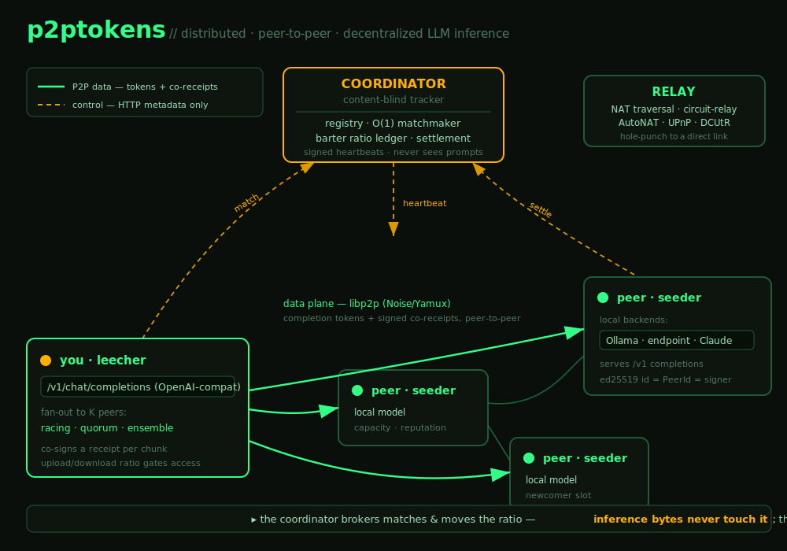

<div align="center">



### Distributed · peer-to-peer · decentralized LLM inference — seed tokens, leech tokens, no middleman.

**Distributed, decentralized LLM inference across a peer-to-peer swarm** — one
binary that both serves and consumes completions. Bring your own model, earn the
right to use everyone else's.

[](https://www.rust-lang.org/)
[](LICENSE)
[](#install)
[](#how-it-works)
[](#quick-start)

</div>

---

## The idea in one breath

Peer-to-peer file sharing made bandwidth cheap by making everyone a server.
**p2ptokens does the same for GPU time** — **distributed, decentralized
inference**. Run one app; it *seeds* completions from a model you already run
(Ollama, any OpenAI-compatible endpoint, or Claude) and *leeches* completions
from peers when you need them. Access is a no-free-lunch upload/download
**ratio** — the seed/leech incentive model of the **BitTorrent protocol**,
applied to inference — which keeps the swarm honest. A central coordinator
brokers matches but **never sees your data**: the inference bytes flow directly,
peer-to-peer.

<div align="center">
  
</div>

---

## Why p2ptokens is different

Most "distributed inference" projects are **cooperative GPU pools** — you and
machines you trust, sharing capacity for free. That's useful, but it doesn't let
*strangers* trade inference safely, and it has nothing to stop free-riders.
p2ptokens is built as a **market**, and that changes everything:

| | Cooperative GPU pools | **p2ptokens** |
| :--- | :--- | :--- |
| **Incentives** | none — trust-based, free-rider-prone | **barter ratio** (serve to earn), like a private tracker |
| **Anti-cheat metering** | — | **signed co-receipts** — neither side can lie by >1 chunk |
| **Trust model** | your own / trusted group | **strangers welcome** — reputation + audits + signed identity |
| **Coordinator sees data?** | n/a | **no** — content-blind by design |
| **Sybil resistance** | — | **signed heartbeats** — you can't register as someone else |
| **Matchmaking at scale** | gossip | **O(1) per-model index**, flat to 50k peers |
| **Legal/compliance** | none | drafted ToS/AUP/privacy/DPA, 18+ gate, cookie consent |

The bet: the hard part of open inference isn't pooling GPUs you own — it's
**making an economy where people who don't know each other can trade compute
without getting cheated.** That's the whole machine below.

---

## How it works

Four ideas from the **BitTorrent protocol**, made cryptographic:

1. **Seeder + leecher in one.** Every peer serves and consumes. Seed by default,
   leech when you need tokens.
2. **Ratio, not money (v1).** Access is gated by upload/download ratio with a
   newcomer grace allowance — serve first, then draw down. No wallets, no KYC.
3. **Signed co-receipts (the linchpin).** Output streams in chunks; after each
   chunk the consumer co-signs the *cumulative token count*. The provider only
   continues once it holds the receipt, and settles the highest-seq receipt with
   the coordinator, which verifies the signature and moves the ratio.
   → **Neither side can lie by more than one chunk.**
4. **Optimistic unchoke.** Newcomers get reserved slots (which double as
   challenge-audits), so a fresh peer can bootstrap reputation — exactly how a
   peer-to-peer client gives unknown peers a chance.

Your identity is a single **ed25519 keypair** = your libp2p `PeerId` = your
co-receipt signing key. No accounts, no email.

---

## Fan-out — one prompt, many peers

By default a request goes to one peer. You can also **fan a single prompt out to
several peers at once** and choose how to combine them:

| Mode | What it does | Use it for |
| :--- | :--- | :--- |
| `single` | one provider (default; streams) | normal chat |
| `racing` | dial K, return the **fastest** full completion, drop the rest | lowest latency |
| `quorum` | dial K, return the **majority** answer + how many agreed | redundancy / catch a bad peer |
| `ensemble` | dial K, return **all K** answers as separate `choices` | compare models / mixture-of-agents |

Select it three ways — pick whatever your client supports:

```bash
# 1) request field
curl .../v1/chat/completions -d '{"model":"llama3.1:8b","fanout":"quorum","fanout_count":3,
     "messages":[{"role":"user","content":"..."}]}'

# 2) model-name prefix (works with any vanilla OpenAI client)
#    race:  quorum:  ensemble:
-d '{"model":"ensemble:llama3.1:8b","messages":[...]}'

# 3) the dashboard's LEECH TEST panel has a mode dropdown + peer count
```

The coordinator hands back **distinct** providers per request (up to a cap), each
metered by its own co-receipt; peers a race drops are swept automatically. Fan-out
modes are non-streaming (they coordinate results); `single` still streams.

---

## Quick start

Requires [Ollama](https://ollama.com) with a model pulled:

```bash
ollama pull llama3.2:3b
cargo build

# terminal 1 — the tracker
target/debug/p2p-coordinator

# terminal 2 — a seeder (serves your local Ollama)
target/debug/p2ptokens --http 127.0.0.1:8080 --data-dir ./.p2p/a

# terminal 3 — a leecher
target/debug/p2ptokens --http 127.0.0.1:8081 --data-dir ./.p2p/b
```

Open the **dashboard** at <http://127.0.0.1:8081> (ASCII terminal theme), or hit
the drop-in **`/v1` endpoint** — point any OpenAI-compatible client at
`http://127.0.0.1:8081/v1`:

```bash
curl http://127.0.0.1:8081/v1/chat/completions \
  -H 'content-type: application/json' \
  -d '{"model":"llama3.2:3b","messages":[{"role":"user","content":"hi"}],"stream":true}'
```

One-shot end-to-end smoke test: `bash scripts/e2e.sh`.

---

## Install

Works on **macOS, Linux, and Windows** — no system dependencies (TLS is
statically vendored, so **Linux needs no OpenSSL**).

### 🖥️ Desktop app (recommended — just double-click)
A proper installable app (`.dmg`/`.app`, `.msi`/`.exe`, `.AppImage`/`.deb`) built
with **Tauri**. It embeds the full P2P daemon and opens the dashboard in a native
window — no terminal, no config, still 100% peer-to-peer. Source in
[`crates/desktop`](crates/desktop); installers are produced by the `desktop` CI on
each release tag.

```sh
cargo install tauri-cli --version "^2"
cargo tauri dev --config crates/desktop/tauri.conf.json   # local dev
```

### ⌨️ CLI / headless (servers, power users)
Two binaries: `p2ptokens` (client) and `p2p-coordinator`.

```sh
# prebuilt binaries — macOS / Linux
curl -fsSL https://p2ptokens.com/install.sh | sh
# Windows (PowerShell)
irm https://p2ptokens.com/install.ps1 | iex

# or with Cargo (any OS with Rust)
cargo install --git https://github.com/pur4v/p2ptokens p2ptokens-client p2ptokens-coordinator
```

Override source/dir with `P2PTOKENS_REPO=owner/repo` and `P2PTOKENS_BIN`. The
identity keypair lives in the per-OS data dir (override with `--data-dir`).

---

## Running across NAT (no port-forwarding)

Like a modern peer-to-peer client, p2ptokens does the full traversal stack:
**identify + AutoNAT + UPnP + circuit-relay + DCUtR hole-punching**. Run one
public relay; peers behind home routers reserve a `/p2p-circuit` slot and become
reachable, with DCUtR upgrading to a *direct* connection when it can.

```bash
# public relay (no backends needed)
P2P_OLLAMA=0 target/debug/p2ptokens --relay --p2p-listen /ip4/0.0.0.0/tcp/4001
# a client using it
target/debug/p2ptokens --relay-addr /ip4/<relay-ip>/tcp/4001/p2p/<relay-peer-id>
```

Demo: `bash scripts/relay-demo.sh`.

---

## Bring your own backend (BYO-credentials)

Matched purely by model name. The generic **endpoint** backend points at *any*
URL speaking the chat-completions wire format (vLLM / llama.cpp / LM Studio / a
hosted gateway):

```bash
export P2P_ENDPOINT_URL=https://host/v1  P2P_ENDPOINT_KEY=...  P2P_ENDPOINT_MODELS=model-a,model-b
export ANTHROPIC_API_KEY=sk-ant-...       P2P_CLAUDE_MODELS=claude-3-5-sonnet-latest
export P2P_OLLAMA=1                        # on by default; set 0 to disable
```

> [!WARNING]
> Proxying paid/hosted API access to strangers may violate that provider's terms
> and can get the account banned. User-borne risk by design; only Ollama (local)
> is risk-free.

---

## 🏢 Run your own network (self-host / enterprise)

p2ptokens is a **platform** — fork it and run your org's **own private, branded
swarm**. One config file (`p2ptokens.toml`) does it; with no config you just join
the public network.

```bash
cp p2ptokens.example.toml p2ptokens.toml   # then edit [network]/[coordinator]/[brand]

# your coordinator (private — requires the join secret)
p2p-coordinator --config p2ptokens.toml

# each org machine joins the same network + secret
p2ptokens --config p2ptokens.toml
```

| Set in `[network]` / `[brand]` | What it does |
| :--- | :--- |
| `id` | **Network isolation** — peers on a different `id` literally can't open a stream to yours (scoped libp2p protocol). |
| `private` + `join_secret` | **Enterprise gate** — the coordinator rejects any request without `Authorization: Bearer <secret>` → only your machines join. |
| `coordinator.url` / `relay.addr` | Point clients at **your** coordinator and relay. |
| `[brand]` (name, tagline, accent, logo, links) | **White-label** the dashboard live via `/api/config` — no rebuild. |

> [!TIP]
> Precedence is **CLI flags > env vars > `p2ptokens.toml` > defaults**, so you can
> override any single value at launch (e.g. `--network-id acme --join-secret …`).

> [!IMPORTANT]
> v1 coordinator state is in-memory (single instance, no DB yet). Fine for a team;
> for HA, externalize the registry/ledger to Redis/Postgres (scaling path).

---

## Security

Security is a feature here, not an afterthought — strangers trade compute, so the
protocol assumes everyone is hostile.

- **Content-blind coordinator.** It brokers matches and moves the ratio; it never
  sees or carries a single inference byte.
- **Authenticated transport.** libp2p **Noise** (encrypted + mutually
  authenticated) over TCP + Yamux. Dials pin the target `PeerId`
  (`DialOpts::peer_id`), so a tampered address can't redirect you to another peer
  — the handshake fails on identity mismatch.
- **Signed co-receipts.** Every metering step is a signed, cumulative
  acknowledgement — the anti-cheat core.
- **Signed heartbeats.** Each registration is signed by the peer's key and
  verified to hash to the claimed `PeerId` — **you can't register under someone
  else's identity**, poison the index, or spoof capacity.
- **Hardened tracker inputs.** Structural caps + valid-`PeerId` checks + a request
  body-size limit reject malformed/oversized payloads before they touch state.
- **Lean wire format.** The `/match` response carries only what the client can't
  derive (no duplicated peer ids, no default fields) — smaller attack surface and
  lower egress.

> [!CAUTION]
> **Honest limit:** in v1 the serving peer sees prompts **in plaintext** — there
> is no TEE/sandbox yet (contractual only). **v1 is for non-sensitive workloads.**

---

## Performance & scaling

The coordinator is the only central piece and it only touches lightweight
metadata — the heavy tokens are peer-to-peer.

- **Lock-free & parallel.** State is sharded (`DashMap`), no global lock, on
  Tokio's multi-threaded runtime; signature verification runs outside any
  critical section.
- **O(1) matchmaking.** A per-model index + bounded "power-of-K" sampling makes
  each match cost the same at 50 peers or 50,000. Measured **flat at ~77k
  matches/s (~4.6M/min) on a single 8-core box** up to 50k peers — where a naive
  scan collapses to ~125/s.
- **Scale-out path.** Externalize the three maps to a shared store (Redis: a hash
  + TTL registry, `SRANDMEMBER` sampling, `INCRBY` ledger) and coordinators
  become stateless behind a load balancer. A single box already clears "millions
  of RPM"; this is for redundancy.

Reproduce: `bash scripts/loadtest.sh`.

---

## Workspace

| Crate | Binary | Role |
| :--- | :--- | :--- |
| `crates/shared` | — | domain types, identity/crypto, co-receipts, heartbeat auth, wire protocol |
| `crates/coordinator` | `p2p-coordinator` | tracker: registry, matchmaker, ratio ledger, settlement |
| `crates/client` | `p2ptokens` | unified daemon: seeder + leecher + `/v1` endpoint + dashboard |
| `crates/desktop` | `p2ptokens-desktop` | Tauri app embedding the daemon in a native window |

---

## Design decisions (v1) & what's deferred

<details>
<summary><strong>The eight locked v1 decisions</strong></summary>

1. **Exchange unit:** standard streamed chat completions (drop-in `/v1`).
2. **Economy:** barter, no money — an upload/download **ratio** with newcomer grace.
3. **Topology:** hybrid — central coordinator + peer-to-peer data path.
4. **Matching:** exact model name (+ optional quant refinement).
5. **Transport:** libp2p (TCP + Noise + Yamux); `PeerId` == identity keypair ==
   co-receipt signing key; full NAT traversal with a `--relay` rendezvous.
6. **Privacy:** encrypted in transit; coordinator content-blind; provider sees
   plaintext → non-sensitive workloads only.
7. **Onboarding:** reputation-weighted assignment with reserved newcomer slots
   (optimistic unchoke); newcomer jobs double as audits.
8. **Metering:** interleaved **signed co-receipts** (see [How it works](#how-it-works)).
</details>

**Deferred to v2+:** interactive agent sessions with sandboxed execution; a real
money on-ramp + rate-card pricing + bidding; redundant-execution quorum
verification; a **TEE** confidential tier; model-sharding (Petals-style);
decentralizing the coordinator; heavier anti-Sybil (stake).

---

## Legal

Draft documents live in [`legal/`](legal/README.md): Privacy, Cookie, Terms,
Acceptable Use, and Provider Agreement (+ DPA). The dashboard ships an **18+ age
gate** and a **cookie-consent banner**.

> [!WARNING]
> **Drafts, not legal advice.** Written to reflect the real v1 architecture
> honestly (providers see plaintext; no technical anti-logging/sandbox yet — it's
> contractual). Have counsel review and resolve every `[bracketed]` placeholder
> before publishing.

---

## 🙏 Standing on the shoulders of P2P

p2ptokens is a love letter to peer-to-peer networking. Nearly every idea here was
invented decades ago by people who believed the edge of the network — *your*
machine — could be a first-class citizen instead of a dumb client.

- **Bram Cohen** — creator of the **BitTorrent protocol** (2001). This project is his design,
  pointed at GPUs instead of files. The seeder/leecher duality, the swarm, the
  upload/download **ratio**, **tit-for-tat**, and **optimistic unchoke** are all
  his — we simply made the accounting cryptographic. If p2ptokens has a patron
  saint, it's Bram.
- **Shawn Fanning** — **Napster** (1999) proved that millions of strangers'
  computers could form one library, and lit the fuse on the entire P2P era.
- **Justin Frankel & Tom Pepper** — **Gnutella** (2000) cut the last central
  server and showed a network could route with no one in charge.
- And the original architects of the **ARPANET / Internet**, which was
  peer-to-peer by design long before "client/server" narrowed our imagination.

> *"The best way to predict the future is to distribute it."*

To everyone who ever ran a node so someone they'd never meet could download a
little faster — this one's for you. 🌱

---

## License

[MIT](LICENSE). Built with Rust 🦀, [libp2p](https://libp2p.io),
[Tokio](https://tokio.rs), [axum](https://github.com/tokio-rs/axum), and
[Tauri](https://tauri.app).

---

### Trademarks

References to the **BitTorrent protocol** describe a peer-to-peer networking
technique (seeding, leeching, tit-for-tat upload/download ratios) that inspired
this project's design. "BitTorrent" is a trademark of its respective owner.
p2ptokens is an independent, unaffiliated project — not sponsored, endorsed by,
or associated with BitTorrent, Inc. or any other trademark holder. Other names
may be trademarks of their respective owners.
